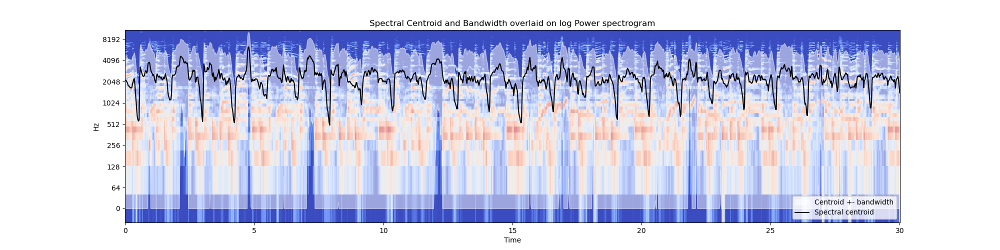
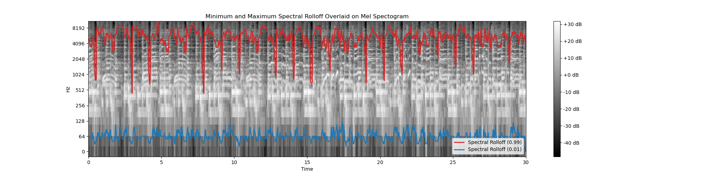
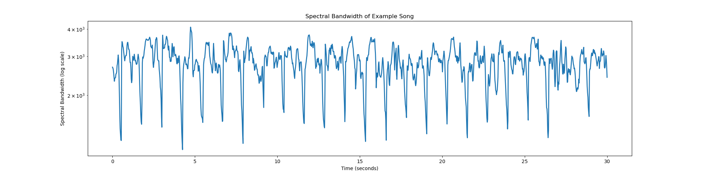
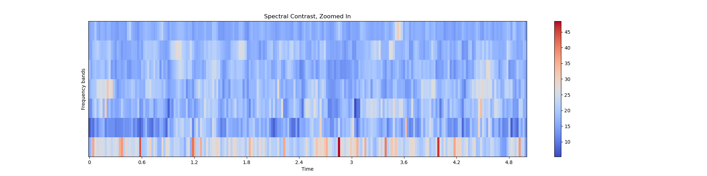
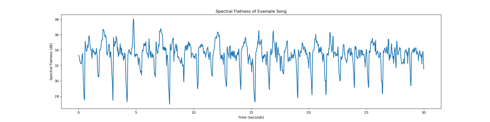
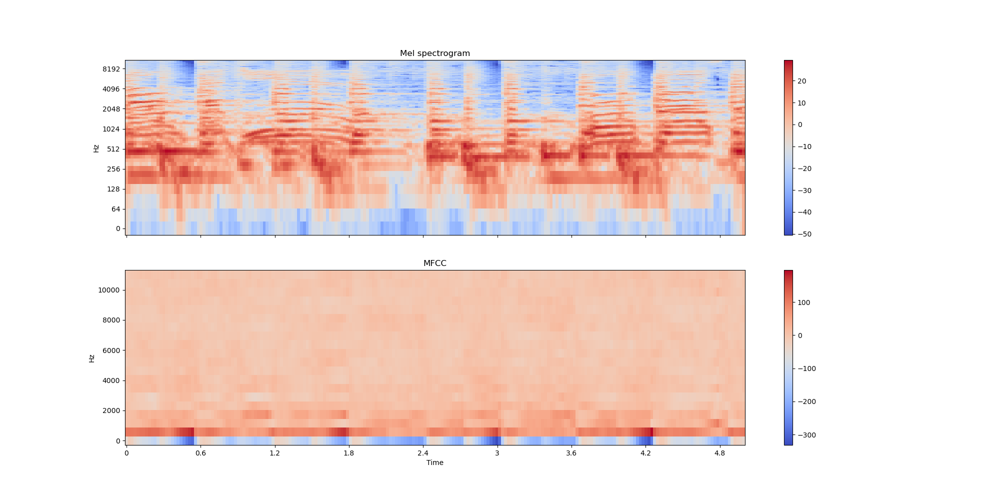
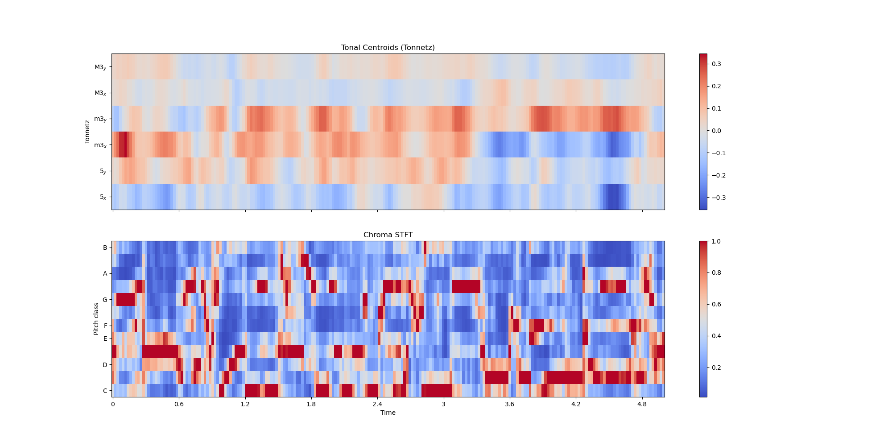
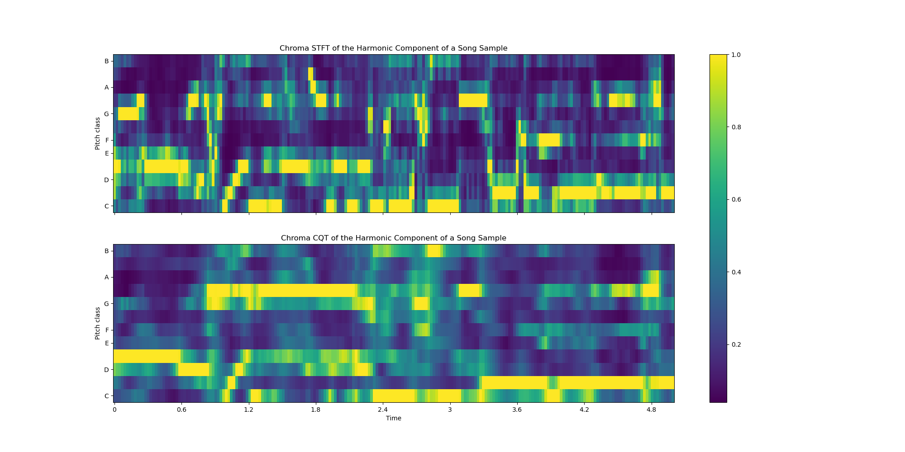
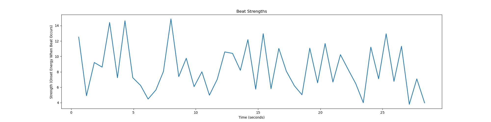
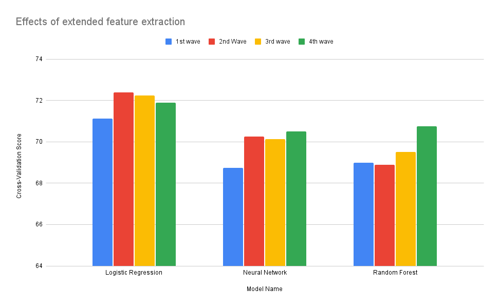

# 378-Project
This is a repository for collaboration on our ELEC 378 final project

# Repo Link
The link to the repo can be found [here](https://github.com/ThomasPickle7/378-Project).

# Objective
- The goal of this project was to classify music samples into one of 10 genres. To do this, we were given 800 labeled, 30-second audio clips and 200 unlabeled ones, which were to be used as testing data. The genres included: Rock, Jazz, Pop, Hip-Hop, Reggae, Country, Metal, Disco, Classical, and Blues.

# Pre-reqs
- Due to their size, the directories 'train' and 'test' containing the respective data aren't stored in the repo and must be downloaded and put in the repository manually

# How to run the code
- The features of the model are saved in the 'features_test' and 'features_train' folders. Each set of features is stored in a .csv file. The features are extracted from the audio files in the 'test' and 'train' folders
- Since the features of the data are already extracted, the only thing necessary to interface with is the 'training_model.ipynb' file. this file contains the code to train/test the model.

# Data Exploration
The data is stored in the 'train' and 'test' folders. Each folder contains 10 subfolders, each corresponding to a different genre of music. Each subfolder contains 100 audio files of 30 seconds each. The audio files are in .wav format.
We began by listening to a few of the samples. Most were high-quality and easy to discern the genre. However, there were a few samples that felt as though they could belong to multiple or even none of those listed in the assignment description. This was useful to know before starting, as it meant that an imperfect model may be expected and that we would need to find a way to quantify the uncertainty of our model's predictions.
Next, we read the files into Python in the form of numpy arrays. Checking the shape revealed that the audio files were 661,504, which is approximately 30 seconds of audio at a sample rate of 22,050 Hz. We also checked the sample rate of the audio files to confirm that it was 22,050 Hz. From this, we knew that if we were going to extract features from the audio files, we would need to reduce the size of the data by some means.
Finally, we plotted some of the audio file's time and frequency domain representations. This was done to get a better understanding of the data and to see if there were any obvious differences between the genres in the time and frequency domains. We found that the time domain representations were very similar between the genres, but the frequency domain representations were different. This was expected, as things like percussive instruments, rhythm, and tempo are more easily discerned in the frequency domain.
  
This shows the time-domain graph of song 1, both the full 30 seconds, as well as zoomed in to the first 5 seconds. The data in this form hasn't been processed enough to directly classify based on it, so we needed to extract features for the models to train based on.

  
Below are the Fourier transforms of several songs, where you can see that there are visible differences in the spectra of each song

# Features
## Extracted Features
Since our project centers around audio signals, we knew that the best place to look for features would be in the frequency domain. We used the Librosa library to extract most of our features. these included structural features, such as tempo, and timbral features, such as the Mel-frequency cepstral coefficients. Below is a list of the features we extracted, along with a brief description of each.
### Centroids
- The spectral centroid indicates at which frequency the energy of a spectrum is centered. This is like a weighted mean:
- This is useful for determining where the "center of mass" of the spectrum is, which can determine how "bright" or "dark" a sound is.\
- The image below shows the spectral centroid as a black line along a 30-second song clip, overlaid with both the spectrum and the bandwidth (shown as centroid +- bandwidth)

### Roll-off
- The spectral rolloff is the frequency below which some amount of the total energy of the spectrum is contained.
- Since the roll-off indicates where the majority of the energy of the spectrum is useful in analyzing where the "body" of the sound is.
- This can be used to find both lower and upper bounds on the energy, as shown below with the gray line showing the bottom 15% of the energy, and the black line the default 85% of the energy.

### Bandwidth
- The spectral bandwidth is the width of the band of frequencies in which the energy of the spectrum is concentrated.
- This is useful for determining how "sharp" or "dull" a sound is.

- The image above shows the raw bandwidth as returned from Librosa, while the image below shows the same bandwidth overlaid on the centroid-spectrogram graph from above

### Contrast
- The spectral contrast is the difference in amplitude between peaks and valleys in a given frequency band.
- This indicates the "sharpness" of the sound, as higher contrast between similar frequencies indicates a sharper sound.
- The image below shows the spectral contrast for the first five seconds of the same audio clip as the rest of the examples

### Flatness
- The spectral flatness is a measure of how "flat" the spectrum is. A flat spectrum has equal energy at all frequencies. For reference, white noise has a flatness of 1, while a pure tone has a flatness of 0.
- This is useful for determining how "noisy" a sound is.

### RMS Energy
- This computes the root mean square energy of each time in the audio sample
- It is useful for gauging the volume of an audio sample, which could benefit the models since certain genres of music are generally louder, but the audio recording quality of the music could hurt the useability of this data for each particular sample
- The RMS Energy for the example song sample is shown below

### Chroma STFT (Short-Time Fourier Transform)
- The chroma stft is a 12-element vector that represents the energy of each of the 12 chroma bands.
- This is useful for determining the "color" of the sound, as it represents the energy of each of the 12 chroma bands.

### Zero crossing rate
- The zero crossing rate is the rate at which a signal changes sign.
- This is useful for determining the noisiness of a sound, as noisier sounds tend to have a higher zero crossing rate. It is also useful for determining the pitch of a sound, as the zero crossing rate is higher for higher-pitched sounds.
### MFCC
- The Mel-frequency cepstral coefficients are a representation of the short-term power spectrum of a sound. They are derived from the Fourier transform of the sound.
- These are useful for determining the timbre of a sound, as they represent the power spectrum of the sound.
- The image below shows the mel-frequency cepstral coefficients for the first five seconds of an audio clip

### Tonnetz
- The tonnetz is a 6-element vector that represents the tonal centroid features of a sound. The tonal centroid is the weighted mean of the frequencies of the sound.
- This is useful for determining the tonal characteristics of a sound, as it represents the tonal centroid features of the sound.
- The graphs below compare the tonnetz with the Chroma STFT, providing a side-by-side view of how the tonnetz isolates the tonal centroid

## Musical Features 
- These features are extracted from the time domain and are represented as numpy arrays, where the ith element corresponds to the ith time frame. The value of each element is the feature of the sample in that time frame.
### Tempo
- Tempo is the speed at which a piece of music is played, and it's measured in BPM (beats per minute).
- This is useful, as different genres of music tend to have different tempos. For example, classical music tends to have a slower tempo, while rock music tends to have a faster tempo.
### Harmonic/Percussive
- Harmonic and percussive components are extracted from the audio signal using the Harmonic-Percussive Source Separation (HPSS) algorithm.
- This is useful for determining the harmonic and percussive components of a sound, as they are often used to distinguish between different genres of music.
- The percussive component can be analyzed for tempo more accurately, while the harmonic component was then fed through the Chroma CQT algorithm to analyze
#### Chroma CQT
- The Chroma CQT function provided by Librosa is a constant-Q chromatogram. A comparison between the Chroma CQT and the Chroma STFT is shown below

### Beat Strength
- Beat strength is a measure of the strength of the beat in a piece of music. By beat strength, we mean the degree to which a beat is emphasized compared to the rest of the music.
- This is useful for determining the rhythm features of a sound, as different genres of music will use different time signatures more often and also make use of different rhythm patterns.

## Aggregation
The features described are time and frequency-series data, meaning that each one is hundreds or thousands of points long.
To reduce the size, which would take up thousands of columns, we aggregated the data. We did this by taking the mean, standard deviation, and global extrema (minimum and maximum) of each feature. This reduced the size of the data from thousands of columns to well under a hundred, which was far more computationally efficient. In doing so, we lost some information but felt that the tradeoff was worth it.

## Preprocessing
- After extracting the features, we normalized the data. We did this to ensure that the features were on the same scale, as some features had much larger values than others. This was done after aggregating the data, as normalizing the data before aggregating it would have resulted in the loss of information from the std and extrema features. We used the MinMaxScaler from sklearn to normalize the data, as it scales the data to be between 0 and 1, which is useful for neural networks.

## Feature Selection
After processing and aggregating the data, we were left with a total of 65 scalar features, derived from 14 spectral features. This seemed like a reasonable number of features to work with, but to be sure, we manually went through the features to see if any could be removed. Some features were removed because they were uniform across all samples. For example, the minimum of the zero crossing rate was zero for every sample, since the zero crossing rate is always positive, so it could be removed. This left us with 60 unique features going into the model.

Since the models and features were developed in parallel, we were able to see the effects of adding more features on each model, both on our training data and on the test submissions. We Found that adding more features generally improved the performance of the models. This was likely because the features were already aggregated, which reduced the chances of overfitting. We also found it useful to split the testing data into a training and validation set, as this allowed us to see how the models were performing on unseen data. This was useful for tuning the hyperparameters of the models.

It's worth noting that although the accuracy of the model only goes up a few percentage points when adding more features on certain models, we believe it was worth the added complexity. We knew that the competition would likely be decided by a few percentage points and that the added data would be worth it, especially considering that the models didn't seem to have slower training times with the added features.

# Model Selection
We used three different models to find the best predictor for our data. These included Multinomial Logistic Regression, a regular Neural Network, and a Random Forest Classifier. Below is a description of each model.
## Neural Network
### Description
One of our models is a Deep Neural Network. Deep Neural Networks are a type of machine learning model that is inspired by the structure of the human brain. They are composed of multiple layers of neurons, each of which takes input data and a set of weights. The neurons then apply an activation function to the weighted sum of the inputs to produce an output. The outputs of the neurons are then passed to the next layer, and so on. The weights of the neurons are learned through a process called backpropagation, which adjusts the weights to minimize the error between the predicted output and the true output. Deep Neural Networks are useful for tasks that require a high degree of nonlinearity, such as image and speech recognition.
### Architecture
The architecture of the model is relatively simple. The input layer consists of 60 nodes, one for each feature. The output layer consists of 10 nodes, one for each genre. The model uses a softmax activation function to output the probability of the song belonging to each genre. The model is trained using the Adam optimizer and the categorical cross-entropy loss function. The model is then validated on a separate set of data to ensure that it generalizes well to unseen data.
### Tuning
We tuned several parameters in creating the neural network. These included an optimizer, a regularizer the number of internal nodes and hidden layers, their respective activation functions, and the number of epochs.
#### Regularizer
- Regulization is the process of adding a penalty term to the loss function to prevent overfitting. We found that an L2 regularizer with a value of .01 worked best for our model, and helped to significantly reduce overfitting.
#### Optimizer
- An optimizer is a method used to better adjust the weights of a model to minimize the loss function. We chose to use the Adam optimizer, which keeps track of how much the model has improved or worsened each iteration, and adjusts the learning rate accordingly. We found that the Adam optimizer worked best for our model, as it was able to quickly converge to a solution.
#### Activation Functions
- An activation function is the function used to determine the output of the neuron. ReLU is a simple activation function that returns the input if it is positive, and zero otherwise. Softmax is a function that normalizes the output of the model to be between 0 and 1, and is useful for multi-class classification problems. We experimented with several activation functions, and found that a combination of ReLU and softmax worked best for our model. 
#### Number of Nodes and Hidden Layers
- The number of input and output nodes are fixed per our categories and features, however there was still the question of how many hidden layers we should use and how many nodes each should have
- Having many layers allowed us to use multiple loss functions and transition between the dimensions of our features gradually. However adding too many layers or nodes often led to the model over-fitting. We tuned our model and found it worked best with 3 hidden layers, each with progressively smaller amounts of nodes.
#### Number of Epochs
- Epochs are instnaces in which a neural net is trained on the input data. Over multiple instances, the network is more able to recognize meaningful patterns in the data and adjust closer to an optimal solution
- While using multiple epochs led to overall better performance, we found that around 50 epochs or more, the model tended toward over-fitting.

## Logistic Regression
### Description
- Logistic regression is a type of regression analysis used to predict the outcome of a categorical dependent variable based on one or more predictor variables. This can be extended to accommodate multiple classes, in what's called Multinomial Linear Regression. In our case, we used the multinomial logistic regression model to predict the genre of a song based on the features we extracted from the audio files. The model works by taking the features as input and outputting the probability of the song belonging to each genre. The genre with the highest probability is then chosen as the predicted genre of the song. The model is trained by adjusting the weights of the features to minimize the error between the predicted genre and the true genre of the song. The model is then validated on a separate set of data to ensure that it generalizes well to unseen data.
### Architecture

### Tuning

## Random Forest
### Description
- For the model that we did not learn about in class, we selected the Random Forest Classifier. Through our description of the model, we will outline why we think it is a good fit for the data, but before that, we wanted to include some helpful links to read about that support our understanding and implementation of the model. If you have further questions, these are all good places to look.
- https://scikit-learn.org/stable/modules/generated/sklearn.ensemble.RandomForestClassifier.html (what we used for implementation)
- https://www.ibm.com/topics/random-forest
- https://en.wikipedia.org/wiki/Random_forest
- https://en.wikipedia.org/wiki/Decision_tree_learning

- The Random Forest model is, at its heart an ensemble of decision trees, so to start we will define these trees. Decision trees are a classical machine learning method where the feature space is partitioned through learning. The structure of the tree denotes some sort of hierarchical prioritization, where we move through data sequentially. A tree is composed of nodes and branches. Each node is the intersection of some feature information, from which the branches differentiate possible values. For our use case, consider tempo. The decision tree would have a node representing tempo values, and branches exiting the node for different ranges. Say that one edge represents a tempo between 120 and 150 bpm, from which the decision tree decides that the corresponding music clip is jazz. A decision tree contains many of these nodes and decisions, where eventually each leaf node represents some kind of classification, depending on which side of each possible decision a test point falls.

- Decision Trees can be very effective when learning training data, but they often struggle with overfitting and bias inherently. The edges of the decision tree often fit too closely to the information in the training data's features. One way this is mitigated is through the Random Forest model. The implementation is an ensemble of decision trees, which for the classification instance means that we compute multiple classifications and then choose the one that appears most, similar to a K-NN algorithm. However, bias and overfitting are not only mitigated through this aggregation. Additionally, each decision tree is constructed with only a subset of the feature information. Thus, if we are training over all 65 features, each decision tree may only be partitioned across 20-30. This subsampling allows for a low correlation across the trees, meaning that their outputs are more resistant to overfitting the data. In our use case, instead of fitting to all of the feature information and possibly overfitting to them, we instead select subsets of the features, and through aggregating the outputs we can find which subsets are most applicable to that test case. This architecture is one we believe is beneficial to this use case particularly because of the inherent variation in the feature space. While genres of music are helpful in grouping and understanding similarities, differences across these groups are inevitable. Thus, by creating these subsets of features and training over them, we can hopefully find which features are most important at a song level, rather than a genre level, and take this difference into account when predicting. So, if we find a jazz song with an exceptionally high tempo, we can still find the other important features that denote it is a jazz song and classify it correctly.
### Implementation and Tuning
- To implement our Random Forest algorithm we used the sklearn RandomForestClassifier. The main parameters when implementing this model are the number of trees and the depth of said trees, meaning how many branches occur before we reach a leaf node (classification decision). To decide on these parameters, we also used the sklearn RandomizedSearchCV method, which finds the best parameter values in a given range according to some metric. We used accuracy for our metric, found the corresponding best parameter values, and then used them in our final implementation. Typically, increasing the number of trees in the forest increases the accuracy of your prediction, while sacrificing greater training time. Additionally, increasing the depth of the trees can lead to greater complexity in our learning, but can easily lead to overfitting the data if we branch too many times. Thus, we want to find an input value that balances this accuracy while not overfitting. We can do this with cross-validation, which helps to mitigate the inherent overfitting of decision trees that we outlined above.

- As we expected, the Random Forest Classifier worked extremely well over training data but struggled when introduced to new test data. We assume that this is likely a struggle that the model has inherently, and thus other models with greater flexibility, like our neural network, could improve upon these results. 
## Validation
- We validated each model using a 20/80 split between training and test data. We did this to ensure that the models were generalizing well to unseen data. Additionally, we used a technique called cross-validation to tune the hyperparameters and feature necessity of the model. Cross-validation involves running the model multiple times, using new subsets of the data for the train/test split each time, to ensure that the model didn't simply overfit to the training data.

# Complete Pipeline
The entire pipeline can be seen in the code that we submitted in the CNN code in that model’s section. But, as a summary, the pipeline could be summarized by the following. 
1. Load the data
2. Extract the features
3. Aggregate the features
4. Normalize the features
5. Split the data into training and validation sets
6. Train the model
7. Validate the model
8. Make predictions on the test data

# Conclusions
## Future Improvements
Something we experimented with but didn't implement in our final solution was preprocessing. The audio clips were given to us in 30-second segments, which we felt was too long. Some improvements could have been made including splitting up the audio clips into smaller segments. One idea we had was to potentially split it into 2-second clips because on average (meaning looking at the 4/4, 3/4, 6/8 time signature) a measure. We felt that a measure would be a reasonable unit measure for music. But if you think about it intuitively, it probably takes a person up to 5 or 7 seconds to recognize the genre of a song. So it would be best to play around with sections of 2 to 7 seconds. This process could have improved the quality of our model greatly, as we'd be able to feed it a larger volume of data. 

This preprocessing could have included not only splitting up the data into intervals but in some ways "shifting" that time series data. Similar to how we can greatly increase the amount of visual data present for a model to learn over by adding small perturbations to an image, like rotating it by a random degree, zooming in, etc., we can do this same thing with the audio data. One example of this is allowing some overlap between each data point, which would increase the length of each section while simultaneously allowing us to have a large sample set. For instance, for the first 30-second audio, we can split it into seconds 1-5, seconds 2-6, seconds 3-7, etc. This process would then still have unique samples for each data point, but with similarities that could be recognized by an appropriate model.

And this leads to another possible improvement. The current implementation of our neural network is simply a multi-layer perceptron, where we have a certain number of deep layers each with a weight matrix that is full dimensionality. However, if we were to preprocess the data as described before, very naturally the neural network could be extended to a convolutional neural network. This would come with the great advantage of minimizing the number of parameters needed to train the model, while not diminishing its efficacy because as mentioned before, convolutional matrices would learn these small shifts in the data. Thus, if we combine effective preprocessing with intentional neural network architecture, we could create a neural network that has more layers, and is trained over more data but does not overfit the data. Such benefits would likely greatly help in the generalizability of our models to the unknown test data.

With this development there comes another point of growth: feature selection and aggregation. As a byproduct of our using a smaller sample size when training our current models, we were forced to aggregate the data in a format that did not create too many parameters for our model, to avoid overfiting. However, if we implement the ideas above, we no longer face that issue and can broaden feature possibilities once again. Another potential direction is to not aggregate the features at all, and instead include complete information of a smaller subset of them which we believe to be the most important. For instance, just the spectrogram of the audio clip. Through doing this, we do not lose any information which may be lost through simply looking at the mean, standard deviation, and extrema of the features. Additionally, there is a chance that minimizing the number of features we include could prevent the models from being confused by confounding attributes. For instance, there may be a very high correlation between the mean of the MFCCs and the standard deviation of the spectral centroid, but we can't know that for sure until we see the efficacy of our models on different subsets of feature information. Thus, attempting to build CNNs with fewer, full-feature information is another potential direction for improvement.
...WRITE MORE HERE

## Takeaways

## Models we will (should) look into
- SVM
- Logistic Regression
- Neural network
- Random Forest

# Potentially useful links
https://www.mage.ai/blog/music-genre-classification
https://www.analyticsvidhya.com/blog/2022/03/music-genre-classification-project-using-machine-learning-techniques/
https://towardsdatascience.com/music-genre-classification-with-python-c714d032f0d8

# Acknowledgements:
- Members:
  - Max Kuhlman
  - Sam Lim
  - Thomas Pickell
  - Alex Zalles